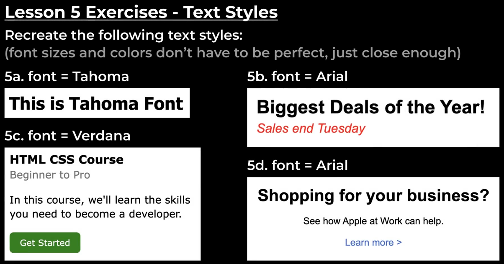
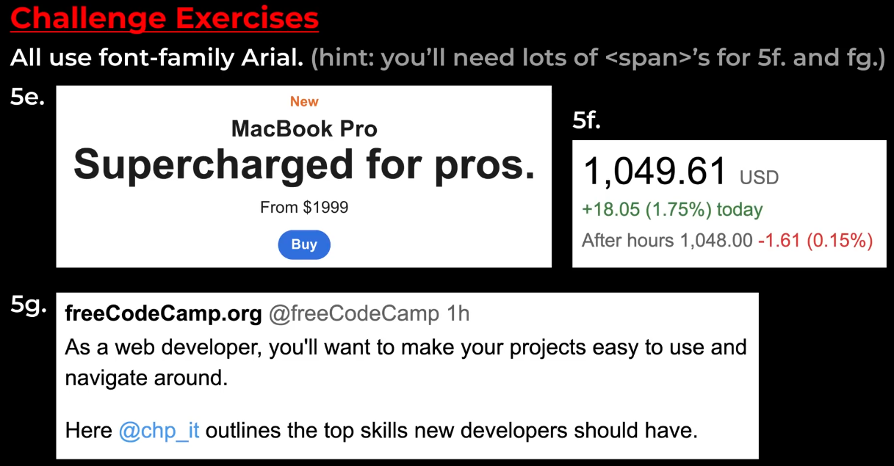

# LESSON 5 TEXT STYLES

In this lesson we learned about :

1. fonts property :
   - font-family - used to specify which font you want to keep.
   - font-size - used to specify the size of the font in the text.
   - font-weight - used to specify the font weight i.e. how thinner or bolder will it be.
   - line-height - used to specify the distance between two lines of text.
   - text-align - used to specify the alignment of the text.
   - text-decoration - used to decorate the text. some values for text decoration are: none, overline, solid, underline, wavy etc.
2. Various HTML Entities :
   - middle dot
   - greater than
   - less than
   - check mark etc.
3. CSS Specificity : Specificity determines which style is going to apply on the element in the html.
   - The selector that's more specific has higher priority.
   - The style with the higher priority will be applied first and then the lower ones.
   - for e.g. Priority of class name selector > element name selector
4. Text elements : used to style a specific part in the line of text.
   - <strong> - used to bold a text.
   - <u> - used to underline a text.
   -  - it is a generic element, it has no styles. we can style a specific part of the text by giving it a class and give it any style we want. it is so flexible.

Note : we could give class to the other text elements but these come with the default styles and that may not be what we want.

# Exercises

