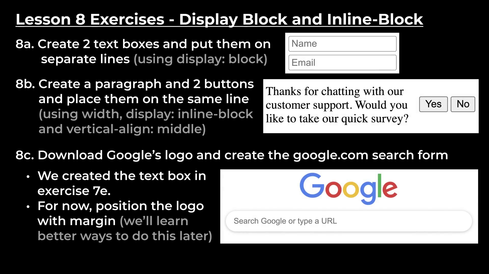
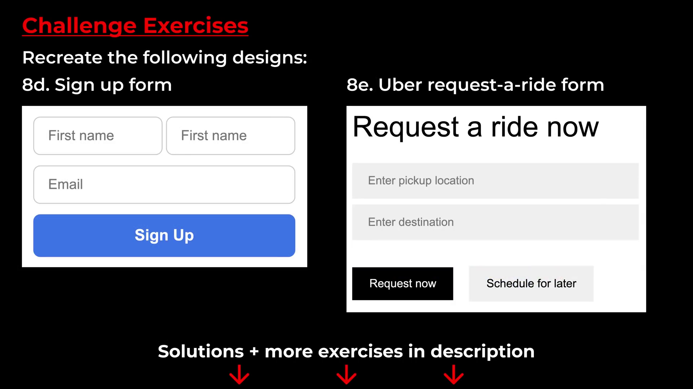

# LESSON 8 CSS DISPLAY PROPERTY

- You might have seen that when you write paragraphs in HTML they're on top of each other but how come the text boxes and images appear on the same line ? 

This happens due to display property in CSS

In HTML, There are three types of elements :

1. **block element** : takes up the entire line. Paragraph by default is a block element. 

    we can see that in our devtools by :

    _Right clicking in the browser > Inspect > Inspector button > Hover over the paragraph._ 

    you'll see that the text ends at some extent, but the paragraph extends to the end of the line. 

    Regardless of how much space they actually take up they take up the entire line. So they're forced to be on their own line.

2. **inline-block element** : only takes up as much space as needed and doesn't take up entire line. So another element can appear beside them.

     An Example of the `inline-block` element is the `` element and the `<input>` element. 

3. **inline element** : inline elements are basically just text elements.They appear within a line of text.

    we have already used an element `<strong>`This element appears within a line of text. So This element makes a part of the text **bold** 

So, Those are the three basic type of HTML elements. Now the most interesting of these three are the `block` element and the `inline-block` element because they determine how the elements are displayed on the page, whether beside each other or above & below.

In addition we can use a CSS property called `display` to easily switch between `block` and `inline-block` elements.

Even though an element is a `block` element or `inline-block` element by default. we can change it by using a `display` property.

- `display : block;` - to switch an `inline-block` element into a `block` element.

- `display : inline-block` - to switch an `block` element into  `inline-block` element.

### Note : 

If we have two sets of CSS Styles that are the same we can use a different syntax by using a `,`_comma_ to target multiple classes or we can say things.

# Exercises :

