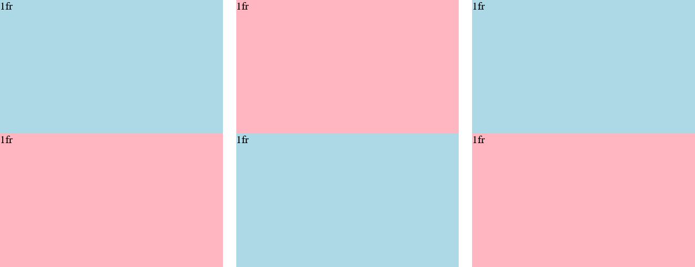

# Lesson-11 CSS Grid

In this lesson we're gonna learn about CSS Grid which is a much better way to create a horizontal layout & grid like given in the final project.

Problems with `display: inline-block;` : 

1.  You may have seen that if you create two divs having `display: inline-block;` a little amount of gap between them appears.   

    
    

    it happens because _there's actually some space between the divs_ & _HTML combines up multiple spaces together & that's what shows b/w the divs._

    You can **remove the gap/whitespace between the two divs shows in `grey` by removing the whitespaces b/w the divs**, But _doing this will degrade the readability of the code._

2. Now the 2nd problem that `display: inline-block;` has is that that it's not vertically aligned.

**So Now, we're gonna learn a new technique called CSS Grid that's gonna help us create perfectly aligned horizontal layouts**

## So, What is a Grid ?

_**A Grid is a layout that has rows & columns.**_

 

**For e.g. this is a 2 by 3 grid, we have 2 rows & 3 columns.**

**This is a 1 by 2 Grid. we have 1 row & 2 columns.**

**So, we're gonna learn how to create this kind of structure in our HTML. To do that we're gonna create a [grid.html](empty link) and style it.**

***There are two steps to create the structure :***

1. The 1st step is to set the `display` property to `grid` i.e. `display: grid;`

2. The 2nd step is we need to set how many columns our grid has ? So, to do that we're gonna use this property `grid-template-columns` Now we're gonna give this property two values, `grid-template-columns: 100px 100px;`. So these two values define how wide our grid columns are. The 1st columns is gonna have a `width` of `100px` and the 2nd columns is gonna have a `width` of `100px` as well and our grid will have two columns.

## Few characteristics of a Grid: 

- First of all Notice that this div no longer taking up the entire line. So Recall that divs are `display: block;` by default.
They suppose to take up the entire line. But when this element(div) is inside a grid,
it's actually placed into a grid it only takes up the entire column instead

- The second thing you notice is that there is no extra space b/w these two unlike with `display: inline-block` .

- And the third thing to notice is that if we add more element this makes the 2nd div taller than the first one but they are vertically aligned.
 and that's another difference b/w `grid` & `display: inline-block;`. Grids manage alignmment much better.

## `fr` - free space 

`fr` : fr is a special value in a grid that stands for free space. it means to take up the remaining
amount of space in the page. So, that's what `1fr` means.

for e.g. if we create a `grid` layout containing three columns and create three divs in those columns and specify the size of the columns as :

`grid-template-columns: 100px 1fr 2fr;` 

it will create 3 *columns* having the `width` of `100px`, `1/3` & `2/3` ***of the remaining page width*** after taking up the `100px`. so ***fr value work is sort of ratio.***

**Remember, if we have more elements than we have columns it will start wrapping around to the second row.**

`column-gap: 20px;` => _creates a gap of_ `20px` _b/w the columns._

Now **what if we want to give space b/w the rows,** well it's simple we have a similar & straight forward property for that i.e. 

`row-gap: 40px;` => _creates a gap of_ `40px` _b/w the rows._

