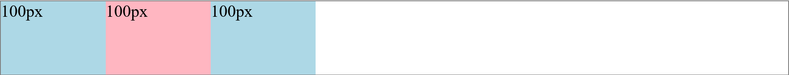
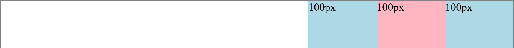
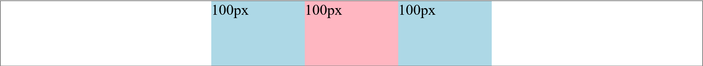
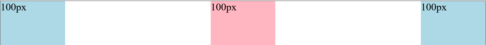
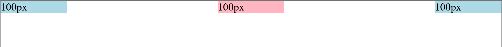
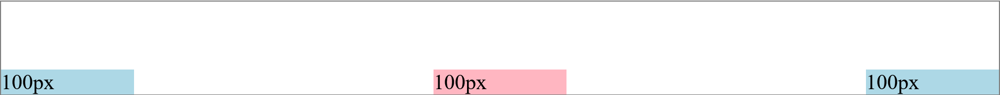
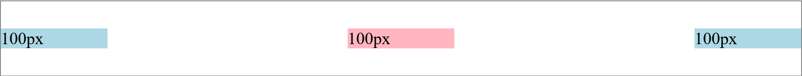

# Flexbox

### In this lesson we're gonna learn about Flexbox it's an anothe way of creating layouts & we are gonna use the flexbox to create the header at the top of the page.

### NOTE :

- _flexbox is similar to CSS Grid._
- _Grid can create the same types of layouts *but flexbox is more flexible*._
- _So just like Grid, **flexbox also requires a container** i.e. parent div. This container is going to be the flexbox & the elements inside the container are gonna placed into our flexbox._

**_So, Now let's learn how to turn our containers into a flexbox_** :

1. set `display: flex;` to the container.

2. Now, set `flex-direction: row;`. This means we are going to align the elements inside the container horizontally in a horizontal Layout.

3. Done. Now the flexbox is created. You can see below example is a flexbox example.

   

**Note :**

- Inside flexbox these div elements which are a `block` elements doesn't behave like them. They behave more like `inline-block` elements.

- They only take up as much horizontal space as they need to.

- Now compare that to Grid where we first set the columns & then the elements inside the columns. So the layout is a little more rigid for Grid.

- Now if we add some more text to the inside div,it exp&s to take up as much space as it needs to. This is a flexible box & that's why we call it flexbox. See below image!

  

- One more thing if we make the other divs taller just like the Grid the flexbox will be vertically aligned i.e. it will still maintain vertical alignment. you can see the divs got taller but it's maintaining the vertical alignment. see below image!

  

- So, flexbox is another way of creating horizontal Layouts while maintaining alignments.

### Similarities b/w flexbox & Grid :

- `1fr` in Grid is equal to `flex: 1;` in flexbox. it is used to take up the entire remaining space. See below image!

  

- So the basic things we can do with the grid we can also do with the flexbox.

### Now let's talk about the differences :

- You can notice that if you change the order of the elements the Layout actually changes. See below image!

  Before Change :
  

  After Change :
  

- The elements keep their width alongwith them if they move around. See image above!

- And that causes us to have flexible Layout depending on how many elements we have & what order they're in.

- So, that's the biggest difference b/w flexbox & Grid.

- We can actually change how they are aligned horizontally

### **flex-direction : it is used to set the direction of the elements in which they'll appear :**

  - `flex-direction: row;` : this will make the elements inside the flexbox appear side by side in a row.

    `flex-direction: row;` : same as text direction (default)

    `flex-direction: row-reverse;` : opposite to text direction.

    `flex-direction: column;` : same as row but top to bottom.

    `flex-direction: column-reverse;` : same as row-reverse top to bottom.

`justify-content` : This determines how the elements in the flexbox are laid out horizontally.

  - `justify-content: start;`: This is the default value of the `justify-content`. it aligns the elements of the flexbox to the start i.e. left side by default elements in flexbox are aligned to the left.

    

  - `justify-content: end;` : this value aligns the elements of the flexbox to the end or right side. 

    

  - `justify-content: center;` : this value aligns the elements in the flexbox to the center.

    

  - `justify-content: space-between;` : this value spreads out the elements evenly across the horizontal space. There is equal amount of space b/w each element.
  This is very useful as we want to spread the icons in the navbar evenly in the header in our project. 

    

So, that's how we control how these elements are positioned horizontally.

Now, the last example that we're gonna go through for flexbox is how to align elements vertically. 

`align-items` : This determines how these elements are aligned vertically in flexbox. 

- The default value is `stretch` which we can see in below image. The elements are stretching to fill up the vertical space. But we also have some options. 

  

- we can align them to the `start` so they will no longer stretched to the vertical space they will only take as much vertical space as they need to & they will be placed at the top as you can see in the below image.

  

- or we can put them to the `end` which will place them at the bottom at the container.

  

- And we can put them in the`center` which will place them in the center which will place them vertically centered.

  
  
- if you'll look at the project we're gonna make all of the things in the header are vertically centered.

_So, Now we learned all the things that we need & we are ready to build the header for our project._