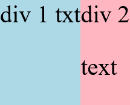

# Flexbox

### In this lesson we're gonna learn about Flexbox it's an anothe way of creating layouts and we are gonna use the flexbox to create the header at the top of the page.

### NOTE : 
- _flexbox is similar to CSS Grid._
- _Grid can create the same types of layouts *but flexbox is more flexible*._
- _So just like Grid, **flexbox also requires a container** i.e. parent div. This container is going to be the flexbox and the elements inside the container are gonna placed into our flexbox._

**_So, Now let's learn how to turn our containers into a flexbox_** : 

1. set `display: flex;` to the container.

2. Now, set `flex-direction: row;`. This means we are going to align the elements inside the container horizontally in a horizontal Layout.

3. Done. Now the flexbox is created. You can see below example is a flexbox example.
    
    

**Note :**
- Inside flexbox these div elements which are a `block` elements doesn't behave like them. They behave more like `inline-block` elements.

- They only take up as much horizontal space as they need to.

- Now compare that to Grid where we first set the columns and then the elements inside the columns. So the layout is a little more rigid for Grid.

- Now if we add some more text to the inside div,it expands to take up as much space as it needs to. This is a flexible box and that's why we call it flexbox. See below image!

  

- One more thing if we make the other divs taller just like the Grid the flexbox will be vertically aligned i.e. it will still maintain vertical alignment. you can see the divs got taller but it's maintaining the vertical alignment. see below image!

  

- So, flexbox is another way of creating horizontal Layouts while maintaining alignments.

### Similarities b/w flexbox and Grid :

- `1fr` in Grid is equal to `flex: 1;` in flexbox. it is used to take up the entire remaining space. See below image!

  

- So the basic things we can do with the grid we can also do with the flexbox.

### Now let's talk about the differences :

- You can notice that if you change the order of the elements the Layout actually changes. See below image!
  
  Before Change :
  

  After Change :
  

- The elements keep their width alongwith them if they move around. See image above!

- And that causes us to have flexible Layout depending on how many elements we have and what order they're in.

- So, that's the biggest difference b/w flexbox and Grid.

### What's the advantage of having flexible layouts like this ?

watched : 3:55:19