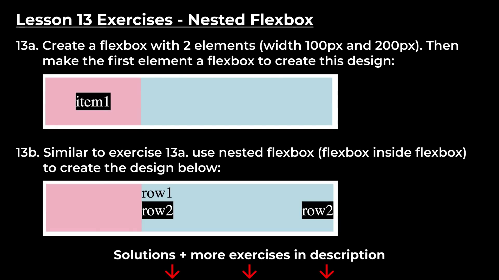

# Lesson-13 | Nested Flexbox

In this Lesson we'll learn about Nested Flexbox i.e. Flexbox inside the Flexbox. 

### Note : 

- **Negative margin** : if we give negative margin for e.g. `-1px` to an element that element will pull another element instead of pushing the element and creating space.

- **To target the placeholder** inside the input text box in CSS you've to write the selector in this format : `input::placeholder` where input is the element.

- **Weird Behaviour of Flexbox :**
  You'll notice that when you resize the browser smaller, the elements inside the flexbox having `justify-content: space-between;` starts to get closer to each other when they have no enough space. So this happens because Flexbox is flexible.
  We start having not enough space it'll start shrinking elements inside. But in our final project this doesn't happens. only the search bar shrinks if we resize the browser.

  Flexbox has a special property to prevent certain items from shrinking.

 - `flex-shrink: 0;` : This determines no matter what happens we're gonna keep this width and we're not goin to shrink. So 0 means don't shrink.

 -  Search-bar has some default width so when it reaches that default width now it doesn't shrinks. so we have to remove it's default width by setting `width: 0;`

# Exercises :
  

  

  