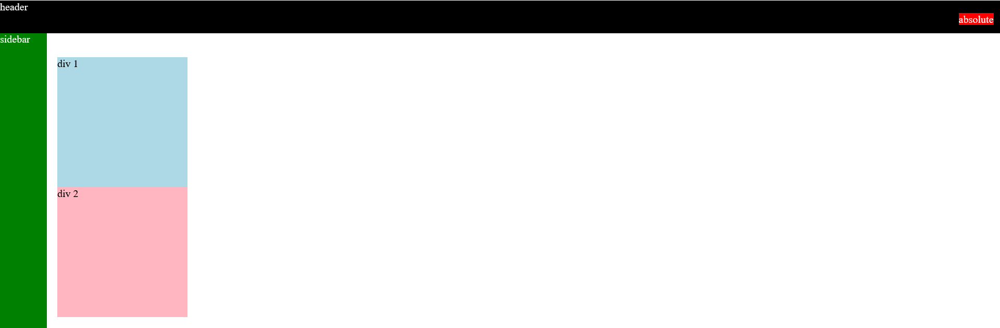

# Lesson-15 | Position Absolute & Relative

In the previous lesson we learned aobut the `position:static;` & `position:fixed;` Property, Now we're gonna learn about another position property that we can use.

So, This time we're gonna learn `position:absolute;`. it also takes values as `position:fixed;` `like` `top`, `bottom`, `left` & `right` but behave a little bit differently. 

### So, what's the difference ? 

- For `position:fixed;` => elements are placed in the <u>***browser window***</u> which doesn't move when we scroll e.g. navbar are placed inthe browser window. So, they don't move when we scroll.

## `position:absolute;` -->

- For `position:absolute:` => elements are placed in the <u>***page***</u> which moves when we scroll. for e.g. video-timestamp, notification-counter, etc.

### `position:absolute;` **has a key feature that is really useful.**

- Whenever `position:absolute;` is put inside a `position:fixed;` element it's gonna be placed relative to the `position:fixed;` element. So this is the most important feature of `position:absolute;`.

- `top:0;` means `0px` from the top of the `position:fixed;` element.

- `right:0;` means `0px` from the right of the `position:fixed;` element.

So, this is how we attach an element to the corners or sides of another element.

In, our project you can see that we've video time in the corner of our video-thumbnail & notification count in the top right corner of the notifications icon. So, using position:absolute; allows us to put elements in the corner like this.

So, there's one last thing we need to learn, Here we have a position:absolute; element inside a position:fixed element that's what we put in the corner. But notice, that this is still a position:fixed element. But In our final project The videos are not sticking to the page, they're scrolling with the page and we've to put stuff in the corner. So, How do we achieve this ? 

### Note :- 

- Generally an element i.e. written below is gonna appear in-front of the element i.e. written above in our code.

    See through below example.

  ```html
  <div>header</div> <!-- position:fixed -->
  <div>sidebar</div> <!--position:fixed -->
  <div>absolute</div> <!--position:absolute -->
  ```
  Here, you can see the element `absolute` is below the elements `header` & `sidebar` so it will appear in front of the elements which are written above i.e. `header` & `sidebar`.

  

## `z-index`

- `z-index` : it determines which elements appear in front and which elements appear behind.

- Default `z-index` is 0 i.e. `z-index: 0;`

- The element with **higher `z-index` will appear in front** of the element which has lower `z-index`. 


### To do this we're gonna learn another value for the position property i.e. `position:relative;`

## `position:relative;`

- It still displays the element as normal.

- If we put `position:absolute;` in here it will position it relative to this `position:relative;` element.

- `right:10px;` now means `10px` right from the `position:relative;` element & not from the page.

- `top:60px;` means  `60px` from the top of the `position:relative;` element & not from the page.

- So two things are happening here :

  1. When position:absolute; is inside the position:relative; this will be positioned on the element, not on the page.

  2. position:relative; causes this whole element to display normally.

So that's what we get in our final project.
Notice that the video display normally they scroll with the page.
But we have something in the bottom right corner.
So these all are position:relative; and then to put something in the bottom-right corner we're gonna put a position:absolute; inside.

### **Note** : You can't put `position:relative;` in `` **elements** as **they're not containers** they can't contain any element inside them. 

`position:static;` will always appear at the back. 
As soon as we set the position to something else i.e. not `position:static;`
like `position:relativ;`, `position:fixed;` 
or `position:absolute;`, 
**The rules of which element was written first will apply.**

So, In this lesson we learned CSS Position 
which is one of the most important skills in CSS.
It allows us to create elements like headers & sidebars
that stick to the page while we scroll & also allows us add
elements on top of another elements. for e.g. video-time on
top of the thumbnail & notifications-count on top of the notification-icon.

### => So, we learned all the Major Skills we need in HTML & CSS to complete our project.

1. Nested Layouts
2. Display:block/inline:block;
3. Grid
4. Flexbox
5. Position

_In the last lesson we're gonna create 
all the other features that were missing 
including the sidebar, the tooltips 
and making our current project look like the final design._

