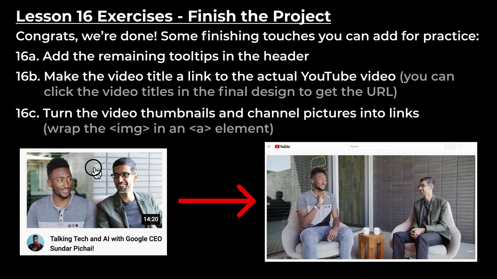

# Lesson-16 | Finish the Project

In this lesson we're gonna finish our final Project (yotube clone) We're gonna create the sidebar and lastly we're gonna create the tooltips when we hover over the header icons.

## CSS Selectors :

<hr>

### 1. Type Selector : Selects all elements that have the given node name.

**Syntax** : `elementname`
**Example** : `input` will match any `<input>` element.

<br>

### 2. Class Selector : Selects all elements that have ghe given `class` attribute.

**Syntax** : `.classname`
**Example** : `.index` will match any element that has a class of "index".

<br>

### 3. ID Selector : Selects an element based on the value of its `id` attribute. There should be only one element with a given ID in a document.

**Syntax** : **#idname**
**Example** : #toc will match the element that has the ID "toc".

<br>

### 4. Attribute Selector : Selects all elements that have the given attribute.

**Syntax** : `[attr]` `[attr=value]` `[attr~=value]` `[attr|=value]` `[attr^=value]` `[attr$=value]` `[attr*=value]`

**Example** : `[autoplay]` will match all elements that have the autoplay attribute set (to any value).

<br>

## Grouping selector

<hr>

### 1. Selector list : The , selector is a grouping method that selects all the matching nodes.

Syntax : `A, B`

Example: `div`, `span` will match both `<span>` and `<div>` elements.

<br>

#

- So, we already learned a class name selector which looks like this....

```css
.sidebar-link {
  height: 36px;
}
```

- And we learned element name selector which just starts with the element name like ....

```css
div {
  height: 36px;
}
```

- Another thing we can do with the CSS is to combine selectors for e.g.

```css
.sidebar-link,
.header {
  height: 36px;
}
```

Now all the styles inside the brackets will target `sidebar-link` & `header` class.

- Another selector we can use is instead of a comma we can use space for e.g.

```css
.sidebar-link img {
  height: 36px;
}
```

This means we're targeting all the images inside the sidebar link. But we're not gonna target all the images inside the whole page.

**Note**: _To center things vertically is really challenging in CSS. The best way to do it using a flexbox, using_ `align-items: center;`.

**Note** :

for `flex-direction: column;` the properties `justify-content` and `align-items` are reversed.
Usually justify-content aligns the element horizontally _while in this case it aligns the element vertically_.

<br>

## Pointer events :

**The `pointer-events` property defines whether or not an element reacts to pointer events.**

What are pointer events then ?

- The events which are generated when we hover over or click on any element are called Pointer events.

- `pointer-events` has a default value of auto

_Property Values of `pointer-events`_ :

1. `auto` : The element **reacts to pointer events, like :hover and click**. This is default

2. `none` : The element **does not react** to pointer events.

3. `initial` : Sets this property to its **default value**.

4. `inherit` : Inherits this **property from its parent element**.

#

`white-space: nowrap;` : This property prevents the text from wrapping around.

\_So, In this Lesson we finished up our final project. we created the sidebar, resize our videos & created the tooltips & Now if we look at our design out project looks pretty much perfect & ready to go.

# Exercises :



### Challenge Exercise  

https://user-images.githubusercontent.com/70604577/160040128-095c8374-1f55-4afa-a99b-55a15143aad8.mp4
