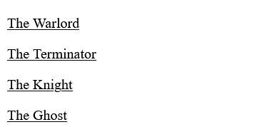

# Lesson-17 | More CSS Features

In the previous lesson we finished our final project. In this lesson we're gonna learn about some more useful CSS. 

We're gonna start with Responsive Design. 

## Responsive Design

If we go to our reference design [here](https://supersimple.dev/exercises/youtube). You can notice that if we make the page smaller we have 2 videos in each row, if we make the page bigger we've 4 videos.

At every screen size the layout adjusts so that the website looks good. So, that's the idea of **Responsive Design** making the website as good as possible for every
screen size.

_So we're gonna learn how to implement Responsive Design into our project_.

Now to make that Responsive we're gonna use something that's called **_Media Query_**

So, To create a **Media Query** we have to write the following syntax: 

  ```css
  @media () {
    /* selector {
      properties ;
    }  */ 
  }
  ```
  In the parenthesis we write the display resolution, so that when the resolution is entered the media query is triggered and the properties inside it are applied. 
  
  **for e.g.** 
  ```css
    /* Media query for width of 0 to 750px */
  @media (max-width: 750px) {
    .video-grid {
      grid-template-columns: 1fr 1fr;
    }
  }

  /* Media Query for width of 751px to 999px */
  @media (min-width: 751px) and (max-width: 999px) {
    .video-grid {
      grid-template-columns: 1fr 1fr 1fr;
    }
  }

  /* Media query for width of 1000px and over */
  @media (min-width: 1000px) {
    .video-grid {
      grid-template-columns: 1fr 1fr 1fr 1fr;
    }
  }
  ```

  So, In the above code you can see we have three different **media queries** for three different screens for making the website to look good and Responsive. This is the basic of How to create a Responsive Design. We just have to write a lot of media queries.

  Next thing we're gonna learn is CSS Shortcuts : 

  ## CSS Shorthand properties : 

  ### 1. `padding` : 

  - So Instead of setting `padding` like this : 
  
    ```css
      padding-left: 4px;
      padding-right: 4px;
      padding-top: 4px;
      padding-bottom: 4px;
    ```
  - We can use a single line of code like this :

    ```css
    padding: 4px;
    ```

  - Another thing we can do is, we can give two values, 

    ```css
    padding: 4px 10px;
    ```
    Here, the **1st value will be the vertical padding** (`padding-top` & `padding-bottom`) & **2nd value will be the horizontal padding** (`padding-left` & `padding-right`) 

  - Next thing we can do is have 4 directions : 
  
    ```css
    padding: 4px 10px 20px 30px;
    ```
    Here, the 1st value is `padding-top`, the 2nd value is the `padding-right`, 3rd value is `padding-bottom` & last 4th value is `padding-left` if you notice its **arranged in clockwise order.** 

### 2. `margin` :

  **`margin` shorthand property works the same way as padding.

Now we're gonna look at one final shorthand property i.e. `border`. 

### 3. `border` :

In, `border`  you'll notice that we always use `border-width`, `border-style` & `border-color`. So instead of setting these styles separately we can use a shorthand called `border` like showed in the following code :

  ```css
  border: 1px solid black;
  ```
  So, this one line of css can replace all the three. 
  where the 1st value is the `border-width`, 2nd is the `border-style` & 3rd is the `border-color`. 

The next thing we're gonna learn is called **inheritance**.

## Inheritance 

Inheritance means that for certain CSS Properties, if we set the properties on the outer elements, it will get passed down to the inner element.

_for e.g. you'have created a div and inside the div you have many text and elements which contain some text. Now, if you give the property of_ `text-decoration: underline` _every text inside the div will **inherit** the property of the parent element i.e. `div` in this case._

### Inheritance Illustration through an example : 

HTML :
```html
<div>
    <p>The Warlord</p>
    <p>The Terminator</p>
    <p>The Knight</p>
    <p>The Ghost</p>
  </div>
```
CSS : 
```css
div {
      text-decoration: underline;
    }
```
OUTPUT : 



**By seeing CSS code & Output, you can notice we've given the `text-decoration: underline;` property to the parent `div` but it is _inherited_ by all the elements which contain text inside itself.**

> **Note : Inheritance Just works with text properties like `text-decoration`, `color`, `font-weight` & `font-family`. It doesn't affect things like border, padding & margin etc.**
 for e.g. if you set a property of `border: 1px solid black;` to the parent div it'll not be passed down to the child elements of that div.

> Note : According to CSS Specificity, The Specific property applied to the element is higher than the inherited from the parent element.

 **This can save us some code.** 

 Next thing we're gonna learn is ***Semantic Elements***. 

 ## Semantic Elements :

 We've learned aobut the bunch of elements like `div`, `img` & the `button`. There's also another set of elements called **Semantic elements** for e.g. `header`
 is a semantic element, another e.g. is the `nav` element. These elements works the same way as the `div` except they have a special meaning to (screen readers), search engines or any other kinds of device such as robots i.e. reading our webpage. So that the structure of our webpage is recognised correctly in screen readers. 
 We should actually replace our divs with the semantic elements.

      semantic elements = <div>
